#Cultfit Clone

Here is The Link
https://cultfit-aayan269.vercel.app/

<link rel="stylesheet" href="https://cdn.jsdelivr.net/gh/devicons/devicon@master/devicon.min.css">

# CURE.FIT (clone) 🏋

**CureFit** is a health and fitness company offering digital and offline experiences across fitness, nutrition, and mental well-being. With the aim to make fitness fun and easy, **CureFit** gives workouts a whole new meaning with a range of trainer-led, group workout classes.

In this project we have tried to make a look alike clone of cure.fit. With our efforts and the technology stack, that we have learned so far in the masai school, we were able to clone the front end with high precision and quality.

# Technology Stack Used 💻

In this project we have used the following tech stack.

- HTML5 <i class="devicon-html5-plain colored"></i>
- CSS <i class="devicon-css3-plain colored"></i>
- SCSS <i class="devicon-sass-original colored"></i>
- LESS <i class="devicon-less-plain-wordmark colored"></i>

Along with that we also made few pages dynamic using JavaScript ES6. In order to store user data we also used LocalStorage (aka browser storage).

 

## How to browse through the project? 🤔

In order to use the project you need to follow the below steps.

1.  Open index.html on live server(using VS code live server).
    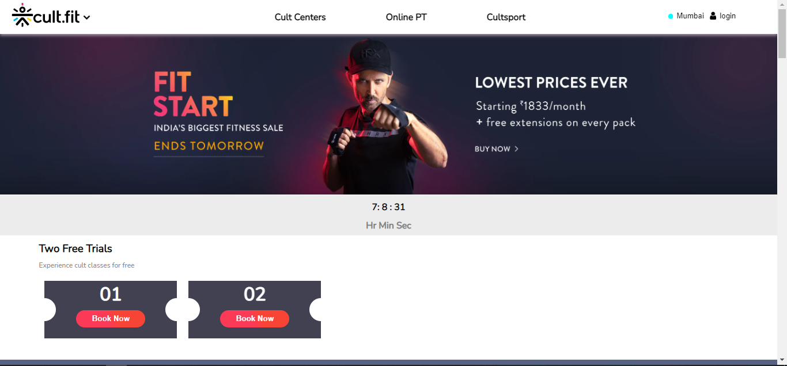

2.  This is our landing page. You can enjoy it for a while and then click on login on the top right to login.
    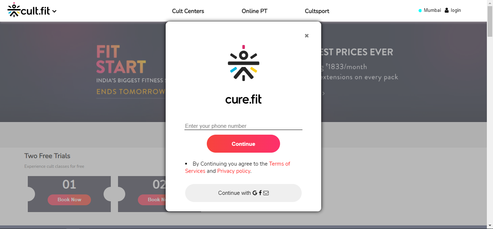

3.  You can last button that says continue...
    

4.  Now you should click to create new user and sign up yourself in the next page.
    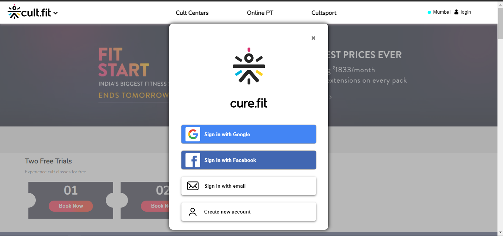

5.  Now you have landed on to our main page.
    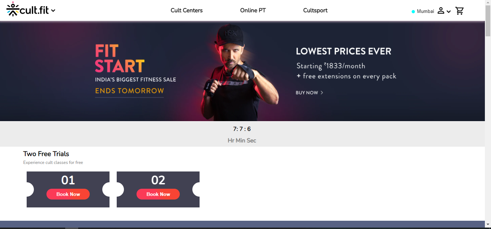

6.  This is our onlinePT.
    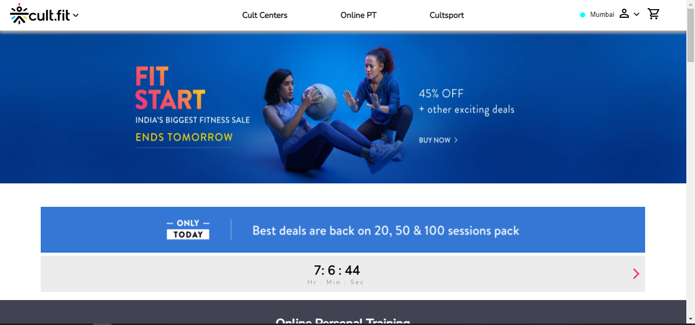

7.  This is our cultSport section where you have different gears to buy.
    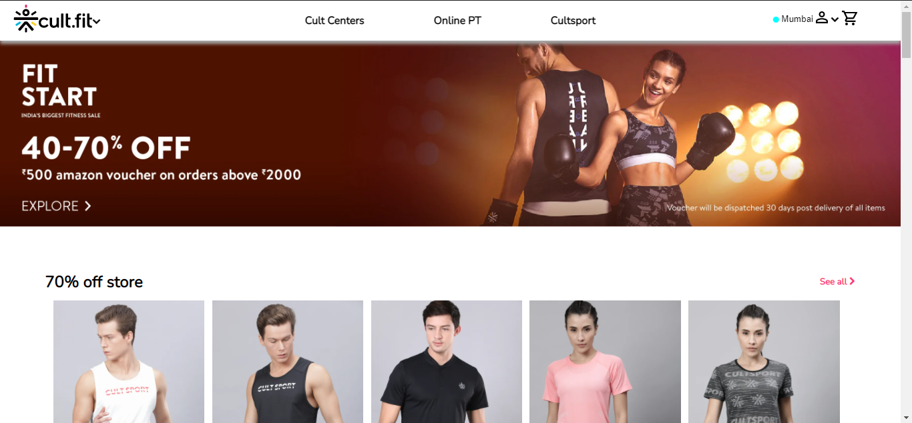

8.  This is our product description page.
    

9.  This is our cart, which appears when you buy something.
    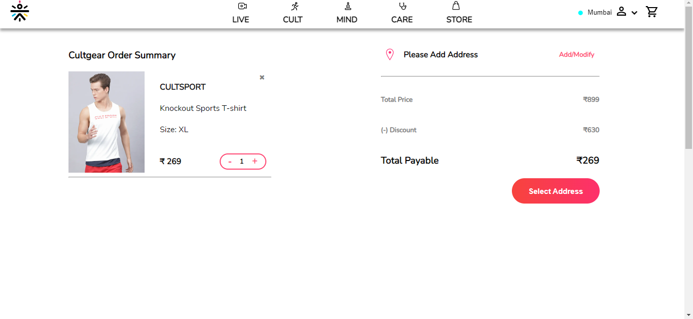

10. This is how other pages will look like (with a notification on the cart icon which tells about the number of items in cart).
    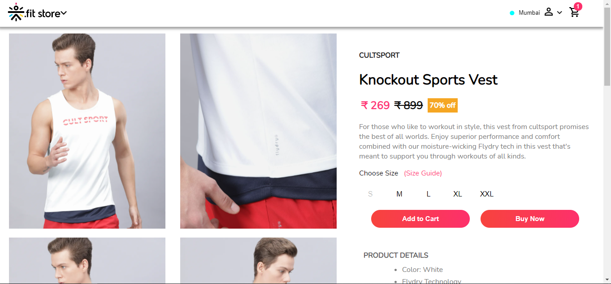

 

## Some more pages we cloned. 🌟

1. User Profile Page.
   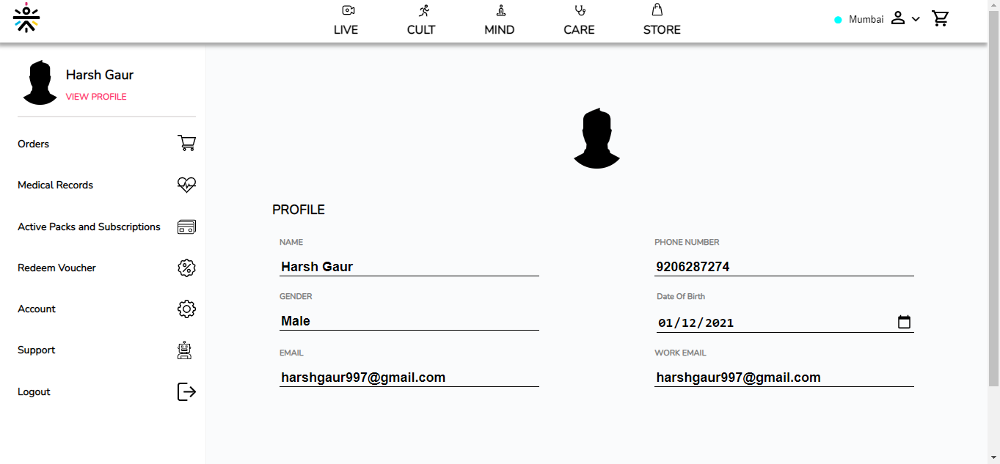

2. Medical Records.
   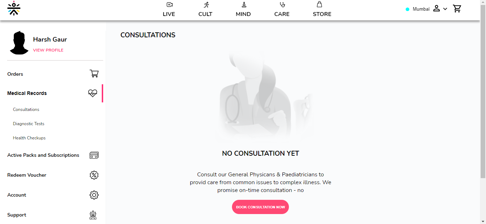

3. Support page.
   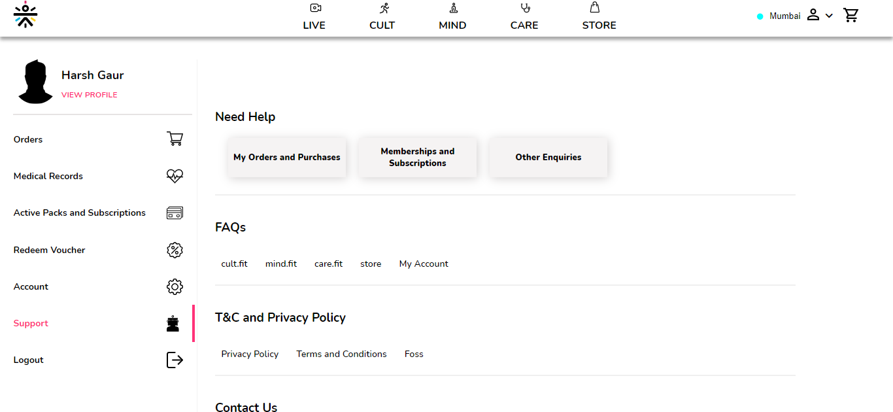

 

## End Notes 📑

In this project we were able to achieve a near to perfect clone of the original website. As we do not want to overwhelm you with the snapshots, we haven't shared all the pages here.Please fork the repository and then use it on your own. If you want to collaborate with us on this project then please fell free to reach out to us.

 

## Video Demo 

https://www.linkedin.com/posts/harshgaur97_project-design-activity-6751535312800952320-1Qce

 
## Features

1. User can view all the products on the store and buy them
2. User can browse the services provided by curefit and manage subscriptions on the profile section

 

## Limitations

1. Not responsive yet and might not be properly visible on small screen devices
2. CSS fails to load sometimes

 

